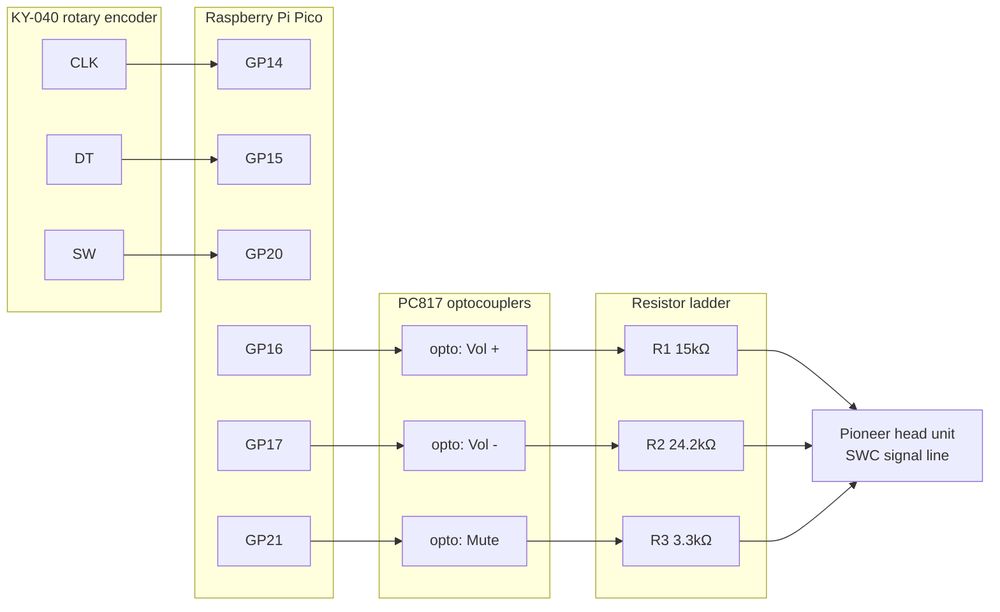

# swc

Firmware for a Raspberry Pi Pico that turns a KY-040 rotary encoder into
steering-wheel-style volume/mute control for a Pioneer head unit.

The Pico reads the encoder and drives three PC817 optocouplers wired to the
head unit's remote-control input pins — one each for volume up, volume
down, and mute — pulsing the matching one whenever the knob turns or is
pressed.

## Hardware

| Signal        | Pico pin |
| ------------- | -------- |
| Vol + (opto)  | GP16     |
| Vol - (opto)  | GP17     |
| Mute (opto)   | GP21     |
| Encoder CLK   | GP14     |
| Encoder DT    | GP15     |
| Encoder SW    | GP20     |

The three optocoupler outputs are configured `PinOutput` and idle LOW; each
is pulsed HIGH for 60ms to register as a button press on the head unit. The
three encoder inputs are configured `PinInputPullup`, matching a standard
KY-040 breakout (idle HIGH, active LOW).



Each optocoupler's phototransistor (output side) switches its resistor onto the
head unit's single SWC signal line, so a press presents a specific resistance
for the head unit to read: R1 15kΩ for Vol +, R2 24.2kΩ for Vol -, R3 3.3kΩ for
Mute.

## Behavior

- Turning the knob clockwise pulses Volume Up; counter-clockwise pulses
  Volume Down. Detection is edge-triggered off CLK's falling edge, with DT's
  level at that instant giving direction.
- Pressing the encoder's built-in switch pulses Mute once per press
  (falling edge on SW), followed by a 200ms debounce pause. Holding the
  button down does not repeat the trigger.

## Requirements

- [TinyGo](https://tinygo.org/) (built against `0.41.x`)
- Go (for running the unit tests on the host; TinyGo brings its own Go
  toolchain for the firmware build)

## Build & flash

```sh
make build   # -> bin/main.uf2, drag onto the Pico in BOOTSEL mode
make flash   # build + flash over a connected Pico
```

## Tests

The polling/edge-detection logic in [controller.go](controller.go) is kept
free of any `machine` package dependency behind a small `pin` interface, so
it runs as plain unit tests on the host — no TinyGo or hardware required:

```sh
make test
```

Hardware wiring and `main()` live in [main.go](main.go), gated behind a
`//go:build tinygo` tag so they're only compiled into the firmware build,
not the host test build.
